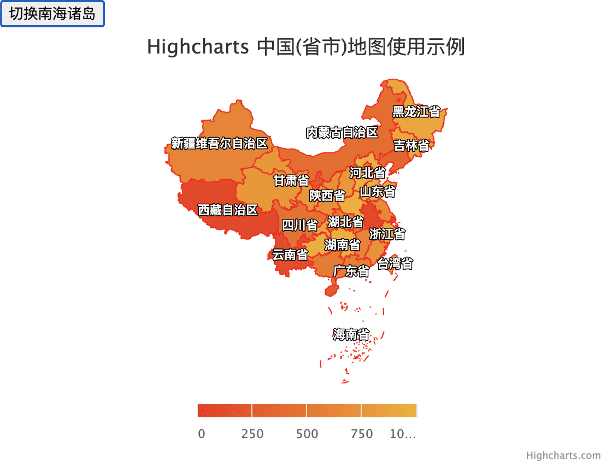
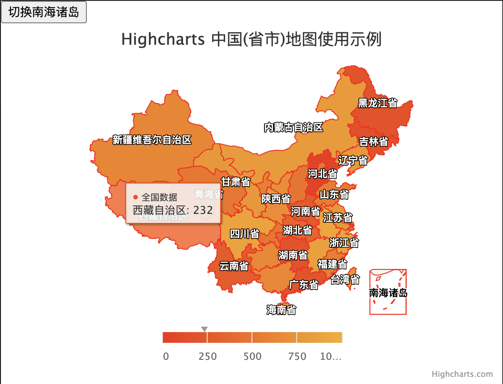

# Highcharts-china-geo

Highcharts 中国地图和中国各省市（下至县级市、区）地图 geo 数据。





## 数据

- `latlng/` ：地图的经纬度坐标geo数据，来自[阿里云 DavaV](http://datav.aliyun.com/tools/atlas/#&lat=31.769817845138945&lng=104.29901249999999&zoom=3)。
- `highmaps/` ：转换后的 js 文件，可直接拷贝至项目中使用。

**说明**
- 文件名以 `行政区域代码.js` 方式命名，所以需先了解中国行政区域代码
- 请求的行政区域包含子区域时，文件名为 `${adcode}_full.js`，如：北京市
- 请求的行政区域不包含子区域，文件名为 `${adcode}.js`，如：东城区

**特别说明**
- `info/china.json` 来自于 ECharts 及其它途径的综合处理，是一份把**南海诸岛单独作为右下角区域**展示的地理数据，格式和 DataV 不一致，经过处理后生成可用文件位于 `highmaps/china.js`
- `info/hainan_geo.json` 是把海南省三沙市（即把南海诸岛）部分删除的地理数据，经过处理后生成可用文件位于 `highmaps/hainan.js`

如果你使用的是 `china.js` 说明没有把三沙市算作海南省，那么钻取到海南省时，需请求 `hainan.js`，你也可以不需要 `hainan.js`，而是请求 `460000_full.js` 后用 JavaScript 语法把三沙市剔除。

## 使用方法

**拷贝 `highmaps` 目录至你的项目中。**

这里我们以请求中国地图为例。

```javascript
const adcode = 100000; // 中国
// adcodeInfo 获取方法见 Q & A
const hasChildren = adcodeInfo[adcode] === true
const fileName = `${adcode}${hasChildren ? '_full': ''}`
await loadMapData(`/highmaps/${fileName}.js`);

const mapData = Highcharts.maps[`countries/cn/${fileName}`];

// 用两层可以方便的单独控制省市名称和数值的展示
const options = {
    series: [{
        // 底图，控制地名，你完全可以不要
        data: [],
        joinBy: 'adcode',
        mapData: mapData,
        enableMouseTracking: false,
        dataLabels: {
            format: "{point.name}"
        }
    },
    {
        // 控制数值
        data: [],
        mapData: mapData,
        joinBy: 'adcode',
        name: 'name1'
    }]
}
```

详细代码可以参看 `/demo/index.html`。

### 在线示例
[Highcharts 中国地图示例](http://natee.github.io/highcharts-china-geo/demo/index.html)

### Q & A
1. 如何修改 `joinBy`？

    答：Highcharts 中 `joinBy` 使用的名称这里默认生成为 `adcode`，如需修改可以自行[构建](##构建)。

2. 怎么判断应该用 `${code}_full.js` 还是 `${code}.js`？
    
    答：如果请求数据的时候你已经知道是不是最小粒度那直接判断即可。如果你还没有办法判断，那么 `utils/infos.json` 文件列出了所有的行政区域相关信息，你可以通过这份文件判断一个行政区域是否有子区域。你需要做的就是通过这份文件处理得到一个你想要的对象，如： `adcodeInfo = { 100000: true, 110101: false}`，你也可以通过 `adcode` 的规则来判断。

3. 南海诸岛怎么显示在右下角？

    答：当你需要把南海诸岛显示在右下角时，请求地图数据换成 `highmaps/china.js`，而不是 `highmaps/100000_full.js`。

## 自定义构建

1. `npm install` 安装依赖包
2. `npm run clear_mapjs` 删除现有 `highmaps/*.js` 
3. 可选，如果你需要更新原始 geo 数据
   1.  `npm run clear_mapgeo` 删除现有文件
   2.  `npm run download` 重新从 DataV 下载 geo 文件，一次执行可能有些会失败，多执行几次，直至无报错即可
5. `npm run transfer [joinBy]`，`joinBy` 为自定义的值，不传默认为 `adcode`


## 许可证
[MIT](http://opensource.org/licenses/MIT)
